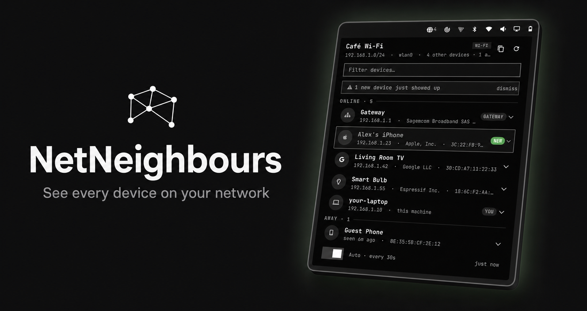

# NetNeighbors

**Who's on your Wi-Fi right now?** NetNeighbors puts a friendly radar button
in your Omarchy bar. Click it and, a couple of seconds later, you see the
whole picture: every device on your network — phones, laptops, TVs,
printers, smart-home gear — with vendor, name, IP and MAC. When an
unfamiliar device shows up, it gets a **NEW** badge so you notice right
away.



## Features

- **One-click network overview** — every device that answers, listed with a
  recognizable icon, vendor, hostname, IP and MAC address.
- **New-device alerts** — devices nobody has seen before are flagged
  **NEW**, both in the list and with a banner when you open the panel.
- **Away view** — known devices that aren't answering right now stay listed
  (dimmed) so you can see who's missing.
- **Easy copying** — click a device to copy its IP, right-click to copy its
  MAC. Great for router allowlists, MAC filters and notes.
- **Zero setup** — no accounts, no cloud, no daemon, no root. Just add the
  widget and it works, refreshing on its own.
- **Quiet by design** — it only ever looks at the network you're connected
  to, and sends nothing anywhere.

## Requirements

- Omarchy (the bar and shell).
- **Python 3** — usually already installed; if not, install the `python`
  package (`sudo pacman -S python` on Arch) and the scan will work.
- Everything else is bundled or comes with the system — no downloads needed.
  Optional extras only improve device names: Avahi (`avahi`) and
  NetworkManager (`nmcli`, standard on Omarchy).

## Install

```sh
omarchy plugin add https://github.com/i12bp8/omarchy-netneighbours.git --enable
```

The globe icon appears on the right side of the bar. If you don't see it,
add it with:

```sh
omarchy plugin enable io.github.i12bp8.netneighbors right
```

## Using NetNeighbors

1. **Click the globe icon** in the bar. A scan starts automatically a
   moment after Omarchy boots, and the panel refreshes whenever you open it
   and the last scan is older than ~10 seconds.
2. **Read the room.** The top of the panel shows your network (SSID and
   range). Below it, one row per device: icon, name, IP, vendor and MAC.
   Your router is tagged **GATEWAY**, your own machine **YOU**, and
   anything new carries a **NEW** badge. Devices that were here recently
   but aren't answering now sit under **AWAY**, dimmed.
3. **Copy an address** — click a row for its IP, right-click for its MAC
   (a small toast confirms). Useful for router admin pages and MAC filters.
4. **Watch for newcomers.** If a device you've never seen appears while the
   panel is closed, the little counter next to the bar icon turns accent
   colored, and a banner greets you next time you open the panel.

The number beside the icon is the live count of *other* devices. Scans
repeat automatically — about every 30 s while the panel is open, at least
every minute while closed. Toggle the **Auto** switch in the panel footer
(or press `A`) to stop background refreshes.

Keyboard shortcuts inside the panel:

| Key | Action |
|-----|--------|
| `R` | Scan now |
| `A` | Toggle auto-refresh |
| `Esc` | Close the panel |
| `Tab` | Move to the next panel |

## Configuration

```sh
# Move the icon to another part of the bar
omarchy bar move io.github.i12bp8.netneighbors --section left

# Change how often it rescans (between 15 and 600 seconds)
omarchy bar set io.github.i12bp8.netneighbors refreshSeconds 60
```

## Privacy

NetNeighbors is completely local:

- **Nothing leaves your machine.** There is no cloud service, no
  telemetry, no daemon phoning home. Scanning means sending one tiny
  "are you there?" packet to each address on your network so devices wake
  up and answer — replies stay on your own network.
- **It remembers what it has seen.** MAC addresses of discovered devices
  are kept in a small file at
  `~/.local/share/io.github.i12bp8.netneighbors/history.json` so it can
  tell you when something *new* appears. Delete that file any time — the
  next scan just starts a fresh baseline.
- **It only writes to its own folder.** NetNeighbors never changes your
  shell configuration or any other file.
- **Be a good neighbor.** This is a tool for networks you own or are
  allowed to explore. On café, hotel or guest networks, other clients are
  usually hidden from you (client isolation) — that's the network
  protecting itself, so you'll mostly see the gateway there.

## Troubleshooting

- **I only see my router (the gateway).** You're likely on a guest or
  public network with *client isolation*, which hides devices from each
  other. On your home network, sleeping devices (or phones with Wi-Fi
  power-saving) also don't answer until they wake up.
- **Vendors show "Unknown".** Modern phones randomize their MAC address,
  and randomized addresses have no vendor entry — completely normal.
- **"Scan failed / no IPv4".** You're offline or on a VPN-only link.
  Connect to your Wi-Fi or LAN first, then press `R`.
- **Scans always fail?** Make sure Python 3 is installed:
  `python3 --version`. If it isn't, `sudo pacman -S python` fixes it.
- **The icon disappeared.** Re-add it with
  `omarchy plugin enable io.github.i12bp8.netneighbors right`.

## Uninstall

```sh
omarchy plugin remove io.github.i12bp8.netneighbors
```

Optionally delete its data folder as well:
`rm -rf ~/.local/share/io.github.i12bp8.netneighbors` — nothing else is
touched.

<details>
<summary>Technical notes (for the curious)</summary>

Scans are quick and harmless: NetNeighbors finds your network's IP range,
sends a single UDP "wake up" packet to each address so the kernel resolves
it, then reads your computer's own neighbor table to see who answered.
Names come from reverse DNS, mDNS (when Avahi is present) and names
remembered from earlier scans; vendors come from a database bundled with
the plugin. All of this runs without root privileges.

Engineering-wise, the scanner runs as a managed, single-instance,
time-boxed subprocess: scans can never overlap, a stale scan is retired
when a new one starts, each scan is hard-capped at about 16 seconds, and
all command output and result data are size-bounded. Its state directory
is private (`0700`) and every file write is atomic and symlink-safe.
See `scanner.py` and `Panel.qml` for the details, and the plugin manifest
(`manifest.json`) for the marketplace entry.

**Installing from a local folder (developers):** copy or symlink this
folder to
`~/.config/omarchy/plugins/io.github.i12bp8.netneighbors/`, then run
`omarchy plugin enable io.github.i12bp8.netneighbors right`. Changes you
save under the plugin folder reload automatically, which makes local
iteration fast.

</details>

## License

MIT — see [LICENSE](LICENSE).
